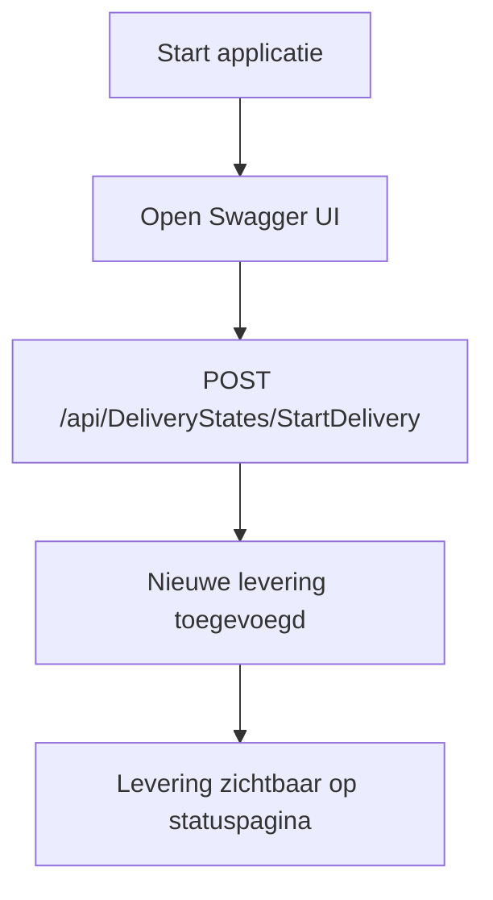

# DeliveryMinimalAPI

**Gemaakt door:**  
Keith Swaen  
Milan Janssen  
Vince Leboux  
Lars Kleijnen

---

## Over dit project
Deze Minimal API is ontwikkeld als backend voor de Matrix Inc. Bezorgersapplicatie. De API maakt het mogelijk om leveringen te starten en op te halen. Deze leveringsgegevens worden weergegeven op de statuspagina van de bezorgersapp.

**Repository:**  
https://github.com/LeVints/DeliveryMinimalAPI

---

## Applicatie starten

1. **Clone de repository:**
   ```sh
   git clone https://github.com/LeVints/DeliveryMinimalAPI
   ```
2. **Open het project in Visual Studio.**
3. **Selecteer het launch-profiel `http`** (rechtsboven bij debugconfiguraties).
4. **Start de applicatie** met de play-knop of druk op `F5`.

De API draait nu op:
```
http://localhost:5111
```

---

## Swagger UI

Open Swagger UI in je browser om de API te testen:
```
http://localhost:5111/swagger
```

---

## Levering starten (testdata toevoegen)

1. Ga in Swagger UI naar:
   ```
   POST /api/DeliveryStates/StartDelivery
   ```
2. Klik op **Try it out** en vervolgens op **Execute**.
3. Er wordt nu lokaal een nieuwe levering gestart.
4. Deze levering wordt toegevoegd aan de statuslijst en is zichtbaar op de statuspagina van de bezorgersapp.

---

## Andere endpoints

| Methode | Endpoint                        | Beschrijving                           |
| ------- | ------------------------------- | -------------------------------------- |
| GET     | /api/DeliveryStates             | Haalt alle leverstatussen op           |
| PUT     | /api/DeliveryStates/{id}        | Past een leverstatus aan op ID         |
| DELETE  | /api/DeliveryStates/{id}        | Verwijdert een leverstatus op ID       |

---

## Applicatie-overzicht



---

## Benodigdheden
- .NET 8.0 SDK
- Visual Studio 2022 of nieuwer

---

## Opmerkingen
- De data wordt lokaal in het geheugen opgeslagen (geen database).
- Bij het herstarten van de applicatie gaat de testdata verloren. 
